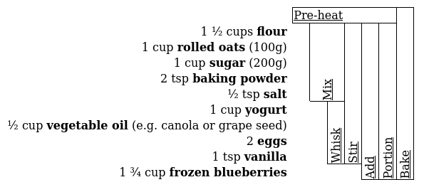
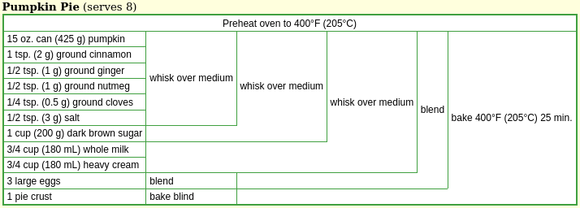
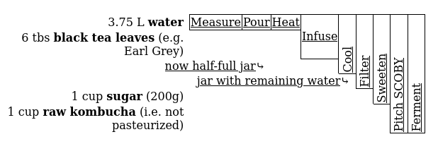

#+TITLE: Breezipe - Easy recipe markup with step-dependency tables

[[https://github.com/jabarszcz/breezipe][Source on GitHub]]

Breezipe is a human-writable XML format for recipes. Steps declare
their dependencies explicitly, and Breezipe uses them to generate a
summary table that makes the recipe's flow visible at a glance.
Ingredient quantities are kept inline, both in the XML source and in
the rendered output, no need to scroll back and forth!

#+CAPTION: Breezipe's step-ingredient table for [[./examples/blueberry_muffins.xml][blueberry muffins]]

* The step-ingredient table

The table is inspired by the recipe summaries on
[[https://www.cookingforengineers.com][cookingforengineers.com]]:

#+CAPTION: Cooking for Engineers's [[https://www.cookingforengineers.com/recipe/65/Pumpkin-Pie][recipe]] for pumpkin pie

Breezipe generates this table automatically from the step definitions
(see [[./step-table.xsl]]). It differs from the CFE format in a few ways:

- *Temporal horizontal axis.* Each column corresponds to a step index.
  Later steps start to the right of earlier steps, even when there is
  no direct dependency between them. This makes it possible to show
  when long steps should be done in parallel.

- *DAG support.* Recipes are modelled as directed acyclic graphs
  (DAGs). When a step produces secondary outputs - a reserved
  portion, a stock used in multiple places - CFE represents them
  by splitting a cell vertically. This works only for planar graphs,
  and the split is placed arbitrarily, obscuring the relationship to
  the ingredients in the same row. Breezipe instead starts a new row
  for each secondary result, anchored to the same column as the step
  that produced it. The spatial relationship is always explicit, and
  the layout generalises to non-planar graphs as well.

  #+CAPTION: Breezipe's step-ingredient table for [[./examples/kombucha_first_fermentation.xml][kombucha (first fermentation)]], a planar DAG
  

- *Ingredient-less steps* (pre-heating an oven) systematically get a
  row without an ingredient header.

- *Vertical text* in narrow cells keeps the table compact.[fn:: The
  CFE author has tried this, but his vertical text relied on an
  IE-specific CSS property that the (then new!) Firefox didn't
  implement. He writes about it in this [[https://www.cookingforengineers.com/article/29/Recipe-Summaries-Standards-and-Microsoft][blog post from 2004]].]

* Quick start

** Writing a recipe

A Breezipe recipe is an XML file. Each ~<step>~ carries a short action
verb (~short~ attribute) and an optional ~id~ for reference. Ingredients
are marked up inline with their quantities, and ~<ref>~ elements both
express the dependency on a prior step and stand in for its result in
the text. Related ingredients can be collected into a named ~<group>~.

Here is an excerpt from [[./examples/blueberry_muffins.xml]]:

#+begin_src xml
<?xml version="1.0" encoding="UTF-8"?>
<?xml-stylesheet type="text/xsl" href="../breezipe-xhtml.xsl"?>
<recipe xml:lang="en-CA" xmlns="http://jabarsz.cz/Breezipe" ...>

  <name>Blueberry yogurt muffins</name>

  <step id="dry" name="dry mix" short="Mix">
    Combine and mix the <group><name>dry ingredients</name>:
    <ingredient quantity="1 ½" unit="cups">flour</ingredient>,
    <ingredient quantity="1" unit="cup" note="100g">rolled
    oats</ingredient>, <ingredient quantity="1" unit="cup"
    note="200g">sugar</ingredient>, <ingredient quantity="2"
    unit="tsp">baking powder</ingredient> and <ingredient quantity="½"
    unit="tsp">salt</ingredient></group>.
  </step>

  <step id="wet" name="wet mix" short="Whisk">
    Combine and whisk the <group><name>wet ingredients</name>:
    <ingredient quantity="1" unit="cup">yogurt</ingredient>,
    <ingredient note="e.g. canola or grape seed" quantity="½"
    unit="cup">vegetable oil</ingredient>, <ingredient
    quantity="2">eggs</ingredient> and <ingredient quantity="1"
    unit="tsp">vanilla</ingredient></group>.
  </step>

  <step id="batter" short="Stir">
    Stir the <ref r="dry" /> into the <ref r="wet" />.
  </step>

  <!-- ... -->

</recipe>
#+end_src

See [[./examples/]] for complete examples.

** Rendering

Breezipe ships with XSLT 1.0 stylesheets that transform ~.xml~ files
to XHTML.

*** In the browser

The ~<?xml-stylesheet?>~ processing instruction at the top of each
example file links the stylesheet directly. Open any ~.xml~ file in a
browser - most currently support XSLT, though all major engines have
signalled plans to remove it ([[https://developer.chrome.com/docs/web-platform/deprecating-xslt][details]]).

*** With Nix

A [[./flake.nix][Nix flake]] is provided. Enter the development shell or run
targets directly:

#+begin_src shell
nix develop          # shell with all build tools
nix build .#site     # build static site with rendered examples
nix run .#serve      # serve the site locally on port 8080
nix flake check      # transform and validate examples
#+end_src

*** With ~make~

#+begin_src shell
make transform  # transform only
make clean      # remove generated files
make help       # list all targets
#+end_src

*Requirements:* ~xsltproc~ (libxslt). Validation targets require
additional tools; see the [[./Makefile][Makefile]] or the flake.

*** Joy of Cooking style

An alternative rendering interleaves ingredient quantities with the
step instructions, in the style of Joy of Cooking. It is implemented
in [[./joy-of-cooking-style.xsl]] but not wired into the default transform.

* Format reference

| Element        | Purpose                                                    |
|----------------+------------------------------------------------------------|
| ~<recipe>~     | Root element for a single recipe                           |
| ~<recipes>~    | Root for a recipe divided into sub-recipes                 |
| ~<step>~       | One action; ~id~ makes it referenceable by later steps     |
| ~<ingredient>~ | Inline ingredient with optional ~quantity~, ~unit~, ~note~ |
| ~<group>~      | Named collection of ingredients (e.g. "dry ingredients")   |
| ~<name>~       | Name of a recipe, step, or group; may contain inline XHTML |
| ~<ref>~        | Reference to a prior step or result; implies a dependency  |
| ~<result>~     | Secondary output of a step, referenceable by ~id~          |

The full schema is in [[./breezipe.xsd]]. Steps and ingredients may contain
embedded XHTML for notes, links, and formatting.

* Design notes

** Why XML?

XML is polarising, but the criticism usually applies to XML used as a
data serialisation format, a job JSON does more cleanly. For /markup/ -
annotating words inside running text - it is harder to beat.

A recipe is, at its core, a piece of text with structure embedded in
it: this word is an ingredient name, these words are a quantity, this
sentence is a step. JSON and YAML have no model for that. XML does,
and its extensibility means the schema can grow - for instance,
Breezipe embeds XHTML directly in recipe steps for notes and links.

The other advantage is tooling: ~xsltproc~ ships with libxslt, and
XSLT is supported in browsers.

Writing the verbose
~<ingredient quantity="1" unit="cup">flour</ingredient>~
where Cooklang would write ~@flour{1%cup}~ is a genuine cost. In
practice, a code editor with XML support carries much of that burden.
Whether the tradeoff is worth it depends on how much you value the
other properties.

** XSLT as a programming language

Implementing the step-ingredient table layout in XSLT 1.0 was the
central programming challenge of this project. XSLT is a purely
functional, tree-transformation language without mutable state or
loops - which makes graph traversal and layout interesting to work
out. The algorithm that positions steps on the horizontal timeline,
handles non-planar graphs, and decides when to use vertical text all
lives in [[./step-table.xsl]].

** Recipes as DAGs

A recipe can be modelled as a directed acyclic graph: ingredients and
(sub-)recipe /references/ are leaves, steps are interior nodes, and
edges represent dependencies. The last step is the root.

Most recipes are trees (each result is used exactly once), and the
CFE table format handles trees well. The interesting cases are the
non-tree ones: a stock used in two places, a step that splits into a
used portion and a reserved one. Breezipe handles these by giving each
secondary result its own row, anchored to the column of the step that
produced it. A spatial relationship is preserved.

* Related projects

- [[https://cooklang.org/][Cooklang]] - a lightweight markup language for recipes; much nicer to
  hand-write than XML. Supports referencing other recipes as
  ingredients, but has no step-dependency model within a recipe.
- [[https://github.com/mossblaser/recipe_grid][=recipe_grid=]] - a Python library generating ingredient-step tables
  from a plain-text format. Also supports DAGs: steps with multiple
  outputs list them within the step cell; results referenced by
  multiple later steps are broken out into separate sub-recipe tables
  linked by hyperlinks, trading spatial proximity for modularity.
- [[https://tex.stackexchange.com/questions/648563/how-to-reproduce-cookingforengineers-com-diagrams-in-latex][CFE-style tables in LaTeX]] - for those who want a similar visual in
  LaTeX. The layout is not derived from a dependency graph; the row
  spans and column widths must still be specified manually.
